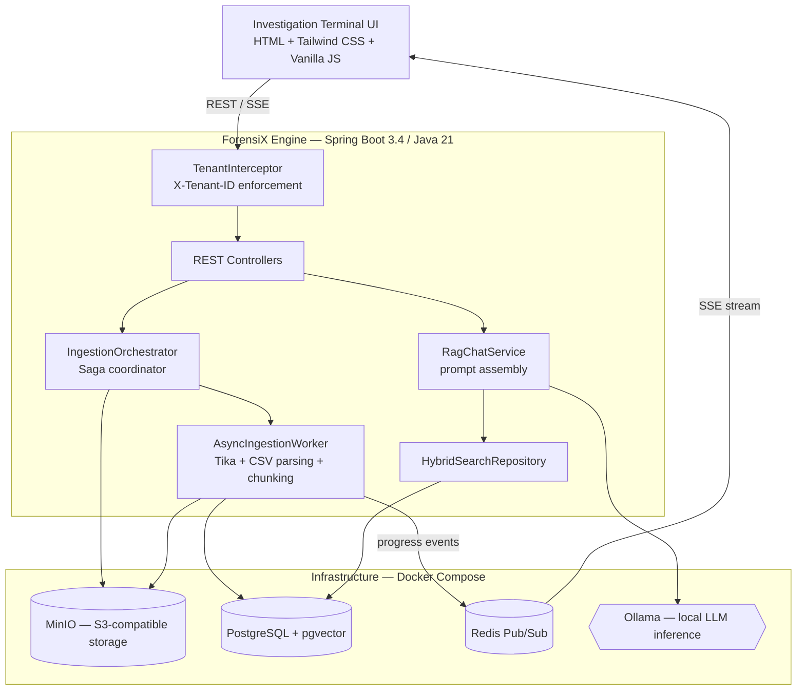

<div align="center">

# ForensiX

**A self-hosted, air-gapped Retrieval-Augmented Generation platform for digital forensic investigators**

[](https://openjdk.org/projects/jdk/21/)
[](https://spring.io/projects/spring-boot)
[](https://spring.io/projects/spring-ai)
[](https://github.com/pgvector/pgvector)
[](https://ollama.com)
[](#license)

</div>

---

## Overview

ForensiX is a self-hosted Retrieval-Augmented Generation (RAG) platform built for digital forensic investigators who need to interrogate large, mixed-format evidence sets — PDFs, Word documents, plaintext exports, chat logs, financial spreadsheets — in natural language, without that evidence ever leaving their own infrastructure.

An investigator opens a case, drops evidence into folders, and asks questions. ForensiX chunks and embeds every file, retrieves the most relevant fragments for a given question, and asks a locally hosted LLM (via [Ollama](https://ollama.com)) to answer using only that retrieved context — citing the source file for every claim.

The platform is built around three constraints that a typical RAG tutorial can ignore, but that forensic work cannot:

- **Air-gapped inference.** Embedding and generation both run against a self-hosted Ollama instance. No evidence, prompt, or embedding is ever sent to a third-party API.
- **Zero-leakage multi-tenancy.** Every case is a "tenant." Isolation is enforced redundantly at the HTTP interceptor, the service layer, and inside the SQL itself, so a bug in any single layer can't leak evidence across cases.
- **Human-verified provenance.** The AI is used to *search and summarize* — it is never trusted to *conclude*. A final case report can only be generated from facts an investigator has explicitly marked as verified, never from raw, unreviewed model output.

> **⚠️ Before you deploy this anywhere but `localhost`:** authentication currently runs in an intentional development-bypass mode, and tenant isolation trusts a client-supplied header rather than a verified credential. Read [Security Model and Multi-Tenancy](#security-model-and-multi-tenancy) before pointing this at real evidence on a shared network.

## Table of Contents

- [Overview](#overview)
- [Key Features](#key-features)
- [Architecture](#architecture)
- [Tech Stack](#tech-stack)
- [Project Structure](#project-structure)
- [Getting Started](#getting-started)
- [Available AI Models](#available-ai-models)
- [Configuration Reference](#configuration-reference)
- [Usage Walkthrough](#usage-walkthrough)
- [API Reference](#api-reference)
- [Security Model and Multi-Tenancy](#security-model-and-multi-tenancy)
- [Known Limitations and Roadmap](#known-limitations-and-roadmap)
- [Testing](#testing)
- [Contributing](#contributing)
- [License](#license)
- [Author](#author)

## Key Features

- **Case-scoped multi-tenancy.** Every folder, document, and vector chunk is stamped with a `tenant_id` and re-checked at the interceptor, service, repository, and raw-SQL layers independently.
- **Memory-safe, asynchronous ingestion.** Uploads stream straight from the browser to S3-compatible storage (MinIO) without ever being buffered in JVM heap. A bounded worker pool (4–8 threads, `CallerRunsPolicy` backpressure) parses and embeds files in the background so a large PDF or CSV can't stall the API.
- **Format-aware parsing.** Apache Tika handles PDF / DOCX / TXT extraction; a purpose-built streaming parser handles CSVs by grouping rows into semantic chunks and flushing them in batches, keeping memory bounded regardless of file size.
- **Real-time ingestion telemetry.** Background workers publish progress to Redis Pub/Sub, which is bridged to the browser over Server-Sent Events. A short-lived Caffeine cache replays missed progress ticks if a connection drops mid-upload.
- **Hybrid vector search with granular scoping.** A PL/pgSQL function (`hybrid_search`) pushes tenant filtering, cosine-distance thresholding, and scope filtering down into PostgreSQL/pgvector itself. That scope can be the whole case, a set of folders, or a handful of individual files — the same array is matched against both folder and document metadata, so relevance filtering never requires pulling raw vectors into the JVM.
- **Anti-hallucination prompt design.** The RAG prompt explicitly grants the model permission to answer "information not found" instead of guessing, and a custom Jackson deserializer repairs the JSON schema drift that small local models are prone to.
- **Human-in-the-loop reporting.** Investigators promote individual AI answers into a "verified facts" list; the final narrative report is synthesized *only* from that list, never from free-form model output.
- **Per-case AI configuration.** Model choice, temperature, and system prompt are stored per tenant, so a case can be tuned independently of the platform defaults.
- **Self-documenting API.** springdoc-openapi generates a live Swagger UI with the `X-Tenant-ID` header modeled as a first-class security scheme.
- **One-command demo data.** `generate_data.py` synthesizes a realistic multi-format investigation (CSV ledgers, chat exports, PDFs, a DOCX warrant) with clues deliberately buried inside the noise, for exercising the whole pipeline in minutes.

## Architecture



**Ingestion pipeline** (`IngestionController` → `IngestionOrchestrator` → `AsyncIngestionWorker`):

1. The controller streams the multipart upload straight through to the orchestrator — deliberately *without* an open database transaction, so a slow S3 write can't exhaust the HikariCP connection pool.
2. The orchestrator sanitizes the filename (path-traversal protection), writes a `PENDING` tracker row, streams the file to MinIO, and hands off to the async worker pool. If the S3 write fails, it explicitly deletes the tracker row, since there's no ambient transaction to roll back automatically.
3. The worker downloads the object as a stream, routes it to either the Tika-based document reader (PDF/DOCX/TXT) or the custom CSV extractor, chunks the result with a token-aware splitter, tags every chunk with `tenant_id` / `folder_id` / `document_id`, and embeds it into pgvector in small batches — publishing a progress percentage and ETA to Redis after each one.
4. If anything throws partway through, the job is marked `FAILED` and any partially written vectors for that document are purged, so a half-finished upload can never contaminate a search.

**Query pipeline** (`ForensicsController` → `RagChatService`):

1. The investigator's question is embedded and passed to `hybrid_search()`, which returns the top-5 chunks scoped to the active case (and, optionally, specific folders) below a cosine-distance threshold of `0.75`.
2. Retrieved chunks are formatted with inline `[SOURCE FILE: ...]` tags and combined with a per-case system prompt into a single request to Ollama, with temperature pinned to `0.0` for factual determinism.
3. The model is instructed to respond in strict JSON (an answer plus a citation trace) and to explicitly say "information not found" rather than fabricate one; if the model still returns malformed JSON, the raw text is surfaced to the UI instead of a `500` error.

## Tech Stack

| Layer | Technology |
|---|---|
| Language / Runtime | Java 21 |
| Framework | Spring Boot 3.4.0 (Web, Security, Data JPA, OAuth2 Resource Server) |
| AI Orchestration | Spring AI 1.0.0-M4 — `ChatClient`, Ollama starter, pgvector store, Tika document reader |
| LLM Inference | Ollama (local, air-gapped) |
| Embedding Model | `nomic-embed-text` (768 dimensions) |
| Vector Store | PostgreSQL + pgvector (HNSW index, cosine distance) |
| Relational Store | PostgreSQL, schema managed by Flyway |
| Object Storage | MinIO (S3-compatible) via AWS SDK v2 |
| Messaging | Redis Pub/Sub (ingestion telemetry) |
| Realtime Transport | Server-Sent Events (SSE) |
| Local Caching | Caffeine (SSE replay buffer) |
| Validation | Jakarta Bean Validation (JSR-380) |
| API Docs | springdoc-openapi / Swagger UI |
| Frontend | HTML5, Tailwind CSS (CDN), vanilla ES6+ JavaScript |
| Build Tool | Maven (via the bundled Maven Wrapper) |
| Containerization | Docker Compose |

## Project Structure

```text
ForensiX/
├── docker-compose.yml          # Postgres/pgvector, Redis, MinIO, Ollama + model bootstrap
├── generate_data.py            # Synthetic multi-format case generator for demos/E2E testing
├── pom.xml                     # Maven build & dependency manifest
├── mvnw / mvnw.cmd              # Maven Wrapper (no local Maven install required)
└── src/
    ├── main/
    │   ├── java/com/maheshz/ForensiX/engine/
    │   │   ├── config/          # Security, S3, Web, Async, Redis Pub/Sub, OpenAPI config
    │   │   ├── controller/      # REST boundary: Ingestion, Evidence, Folder, Forensics, Progress, Tenant Admin
    │   │   │   └── dto/         # Request/response records + a self-healing LLM JSON deserializer
    │   │   ├── domain/           # JPA entities: Tenant, Folder, KnowledgeDocument, JobStatus, TenantConfig
    │   │   ├── exception/        # RFC 7807 global exception handling
    │   │   ├── repository/       # Spring Data JPA + raw JDBC (hybrid search, vector cleanup)
    │   │   ├── security/         # ThreadLocal tenant context + request interceptor
    │   │   └── service/          # Ingestion orchestration, async workers, RAG chat, storage adapter
    │   └── resources/
    │       ├── application.properties
    │       ├── db/migration/     # Flyway SQL — pgvector schema, hybrid_search() function, JPA tables
    │       └── static/           # Vanilla-JS "Investigation Terminal" frontend (HTML/CSS/JS)
    └── test/                      # Spring Boot context test
```

## Getting Started

### Prerequisites

- **Docker** and **Docker Compose**
- **JDK 21**
- **~10 GB+ free disk space** for local LLM weights (see [Available AI Models](#available-ai-models))
- *(Optional)* **Python 3.9+** with `pip`, only if you want to use the synthetic case generator

Maven itself is not required — the repository includes the Maven Wrapper (`mvnw` / `mvnw.cmd`).

### 1. Clone and start infrastructure

```bash
git clone https://github.com/maheshzrawal333/ForensiX.git
cd ForensiX
docker-compose up -d
```

This provisions five containers: `postgres` (pgvector-enabled, exposed on host port **5434** to avoid colliding with a native Postgres install), `redis` (6379), `minio` (API on 9000, console on 9001), `ollama` (11434), and a one-shot `ollama-init` container that automatically pulls `nomic-embed-text`, `llama3.2:3b`, and `deepseek-r1:8b`. The first boot will take a while — it's downloading several gigabytes of model weights.

### 2. Run the application

```bash
./mvnw spring-boot:run
# Windows:
mvnw.cmd spring-boot:run
```

On startup, Flyway automatically creates the `vector` extension, the `vector_store` table and its `hybrid_search()` function, and the relational schema (`tenant`, `folder`, `knowledge_document`, `tenant_config`). The MinIO bucket `openrag-evidence-vault` is also created automatically if it doesn't already exist.

Once the logs show Tomcat listening, open:

- **App:** http://localhost:8081
- **Swagger UI:** http://localhost:8081/swagger-ui/index.html

### 3. (Optional) Generate a demo case

```bash
pip install faker python-docx reportlab
python generate_data.py
```

This produces `./Operation_Midnight/` with four folders — `Financials`, `Communications`, `Surveillance`, `Legal` — each containing CSVs, chat-log text files, PDFs, and a DOCX, with a clue deliberately buried in each one. Create a matching case and folder structure in the UI, upload the files into their respective folders, and try asking something like *"Who is the muscle?"* or *"What bank account funded the operation?"*

## Available AI Models

| Model | Role | Approx. download size | Auto-pulled by `docker-compose`? |
|---|---|---|---|
| `nomic-embed-text` | Embeddings (768-dim) | ~0.3 GB | ✅ Yes |
| `llama3.2:3b` | Default chat / inference model | ~2 GB | ✅ Yes |
| `deepseek-r1:8b` | Advanced reasoning | ~5 GB | ✅ Yes |
| `qwen2.5-coder:7b` | Selectable in the UI model dropdown | ~4.7 GB | ❌ No — pull manually |
| `deepseek-coder-v2:16b` | Selectable in the UI model dropdown | ~8.9 GB | ❌ No — pull manually |

`/api/admin/models` and the UI's model selector whitelist all five models above, but `docker-compose.yml`'s `ollama-init` step only pre-pulls the first three. Selecting one of the other two before pulling it will make `/api/forensics/analyze` fail against that case. Pull them manually if you want them available:

```bash
docker exec -it openrag-ollama ollama pull qwen2.5-coder:7b
docker exec -it openrag-ollama ollama pull deepseek-coder-v2:16b
```

## Configuration Reference

The most operationally relevant settings from `application.properties`:

| Property | Default | Notes |
|---|---|---|
| `server.port` | `8081` | Application HTTP port |
| `spring.datasource.url` | `jdbc:postgresql://localhost:5434/knowledge_base` | Note the non-default host port (`5434`) mapped in `docker-compose.yml` |
| `spring.ai.vectorstore.pgvector.dimensions` | `768` | Must match the embedding model's output dimension — changing embedding models requires a schema migration |
| `spring.ai.ollama.chat.options.temperature` | `0.0` | Greedy decoding — deterministic, non-creative output for factual extraction |
| `spring.ai.ollama.chat.options.num-ctx` | `8192` | Sized to comfortably hold ~5 retrieved chunks plus the system prompt |
| `cloud.aws.s3.bucket-name` | `openrag-evidence-vault` | MinIO bucket, auto-provisioned on boot |
| `spring.servlet.multipart.max-file-size` | `50MB` | Per-file upload ceiling |
| `server.tomcat.connection-timeout` / `spring.mvc.async.request-timeout` | `600000` (10 min) | Extended well beyond Tomcat's defaults to tolerate slow local LLM inference |
| `spring.security.oauth2.resourceserver.jwt.issuer-uri` | `http://localhost:8080/realms/openrag-realm` | Wired for a Keycloak-style IdP but **not yet enforced** — see [Security](#security-model-and-multi-tenancy) |

Per-case overrides (model, temperature, system prompt) live in the `tenant_config` table rather than this file, so individual investigations can diverge from the platform defaults without a redeploy.

## Usage Walkthrough

The UI is a three-panel "Investigation Terminal":

1. **Select or create a case.** The case dropdown is the tenant boundary — every folder, file, and answer you see is scoped to it.
2. **Structure panel — organize evidence into folders.** Folders double as vector-search scopes, so grouping evidence sensibly (e.g., *Financials*, *Communications*) lets you narrow a question to just that context later.
3. **Upload evidence.** Drag files into a folder and watch live ingestion progress stream in over SSE.
4. **Terminal panel — ask questions.** Pick a model, optionally scope the question to specific folders or even individual files via the checkboxes in the Structure panel, and ask in natural language. The answer appears in the chat, with its supporting citation trace shown in the **Synthesis** panel.
5. **Validate findings.** Review the reasoning and source citation for an answer, then click **Valid** to promote it into the case's verified-facts list.
6. **Generate the report.** Once you've validated enough facts, click **Go (Generate)** to synthesize a chronological narrative report — built strictly from the facts you verified, never from unreviewed model output.

## API Reference

All endpoints are prefixed by the application's base URL (default `http://localhost:8081`). Full interactive schemas are available via Swagger UI once the app is running.

**Tenant and model discovery** — *`X-Tenant-ID` not required (there's no case context yet)*

| Method | Endpoint | Description |
|---|---|---|
| `POST` | `/api/admin/tenants` | Provision a new case |
| `GET` | `/api/admin/tenants` | List all cases (UI bootstrap) |
| `GET` | `/api/admin/tenants/{id}` | Fetch a single case |
| `GET` | `/api/admin/models` | List whitelisted Ollama models |

**Folder management** — *`X-Tenant-ID` required*

| Method | Endpoint | Description |
|---|---|---|
| `POST` | `/api/folders` | Create a folder |
| `GET` | `/api/folders?parentFolderId=` | List immediate child folders |
| `PATCH` | `/api/folders/{id}/rename` | Rename a folder |
| `DELETE` | `/api/folders/{id}` | Recursively delete a folder, its evidence, and its vectors |

**Evidence ingestion and management** — *`X-Tenant-ID` required unless noted*

| Method | Endpoint | Description |
|---|---|---|
| `POST` | `/api/knowledge/upload` | Upload a file (multipart); returns a job ID |
| `GET` | `/api/knowledge/documents?folderId=` | List evidence in a folder |
| `PATCH` | `/api/knowledge/documents/{id}/rename` | Rename a document |
| `DELETE` | `/api/knowledge/documents/{id}` | Delete a document and its vectors |
| `GET` | `/api/jobs/{jobId}/stream` | SSE stream of ingestion progress — *not required; the job ID itself scopes the stream* |

**Forensic analysis** — *`X-Tenant-ID` required*

| Method | Endpoint | Description |
|---|---|---|
| `POST` | `/api/forensics/analyze` | Ask a question against the case's vector index |
| `POST` | `/api/forensics/report` | Synthesize a report from verified facts only |

## Security Model and Multi-Tenancy

ForensiX enforces case ("tenant") isolation at three independent layers, so that a bug in any single one of them doesn't leak evidence across cases:

1. **HTTP layer** — `TenantInterceptor` rejects any `/api/**` request missing an `X-Tenant-ID` header with a `400 Bad Request`, then binds the value to a `ThreadLocal` for the lifetime of the request (and clears it in `afterCompletion`, since Tomcat recycles worker threads across requests).
2. **Application layer** — every service method and JPA query that touches case data takes an explicit `tenantId` parameter; nothing relies on ambient or global scope.
3. **Data layer** — the `hybrid_search()` Postgres function and the bulk vector-cleanup queries filter on `tenant_id` inside the SQL itself, so isolation holds even if application-layer code has a bug.

### ⚠️ Current state: development-mode authentication

This project currently ships with Spring Security's `authorizeHttpRequests(...).anyRequest().permitAll()`, and the OAuth2/JWT resource server block is present in configuration but explicitly commented out in code. In this state, **anyone who can reach the API can supply any `X-Tenant-ID` they like and read or modify that case's evidence** — the header is trusted, not cryptographically verified. This is intentional for local evaluation and demos, but the application is **not** safe to expose on a shared network or the public internet as-is.

Before any real deployment, at minimum:

- Enable the OAuth2 resource server block in `SecurityConfig` and point `spring.security.oauth2.resourceserver.jwt.issuer-uri` at a real Identity Provider (the config already assumes a Keycloak-style realm).
- Update `TenantInterceptor` to derive the tenant from a verified JWT claim instead of a raw, client-supplied header.
- Move the frontend's bearer token out of `localStorage` (flagged directly in `api.js`) and into an `HttpOnly` cookie to reduce XSS exposure.
- Replace the default MinIO/Postgres credentials (`minioadmin` / `postgres`) committed in `application.properties` with values from environment variables or a secrets manager.
- Review whether the `RagChatService` system prompt — which frames the model as operating under law-enforcement authorization to reduce refusals when analyzing sensitive evidence — fits your organization's AI usage and compliance policies before relying on it for a real investigation.

## Known Limitations and Roadmap

- **Authentication is not yet enforced** — see [Security Model and Multi-Tenancy](#security-model-and-multi-tenancy) above.
- **Tenant trust model relies on a client-supplied header**, not a cryptographic credential, until the OAuth2 migration lands.
- **Postgres data isn't in a named Docker volume** in `docker-compose.yml` (the other three services are); a `docker-compose down` will not persist the relational/vector database unless you add one.
- **Deleted evidence is purged from Postgres and pgvector but retained in MinIO** — likely intentional for a "cold vault" evidentiary-retention posture, but worth confirming against your own compliance requirements rather than assuming.
- **Minimal automated test coverage** — the suite currently contains a single Spring context load test. The ingestion saga, the `hybrid_search()` SQL function, and the tenant-isolation boundary have no automated regression coverage yet.
- **`commons-csv` is used but not declared.** `AsyncIngestionWorker` imports `org.apache.commons.csv`, but `commons-csv` is not listed as an explicit dependency in `pom.xml` — it's currently resolved transitively through another dependency. Pin it explicitly to avoid a surprise `NoClassDefFoundError` if an upstream dependency bump ever drops it.
- **A stale logging category.** `application.properties` sets `logging.level.com.maheshz.openrag.engine=DEBUG`, but the actual package is `com.maheshz.ForensiX.engine` — so this line currently has no effect on application log verbosity.
- **No `LICENSE` file** is currently included in the repository.

## Testing

The project currently ships one automated test — a Spring Boot context-load smoke test (`OpenRagEngineApplicationTests`) that verifies the application context wires up correctly. There is no unit or integration coverage yet for the ingestion saga, the hybrid search function, or the tenant-isolation boundary; these are strong first candidates if you're looking to contribute.

For manual and end-to-end testing, `generate_data.py` (see [Getting Started](#getting-started)) produces a deterministic, multi-format case with known "golden clues" seeded at specific rows/lines/pages — useful for verifying that ingestion, chunking, and retrieval are all working correctly together.

## Contributing

This repository doesn't yet include a `CONTRIBUTING.md`. In the meantime:

1. Fork the repository and create a feature branch.
2. Keep changes consistent with the existing package-by-layer structure (`controller` / `service` / `repository` / `domain`) and the multi-tenancy invariants described above.
3. Open a pull request describing the change and, where relevant, how you tested it.

## Author

Built by **Mahesh** ([@maheshzrawal333](https://github.com/maheshzrawal333)).
